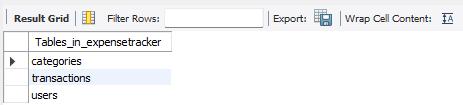
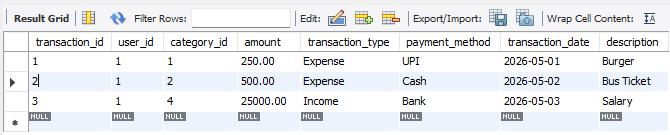
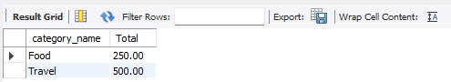
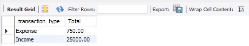

# SQL Expense Tracker Database Project

A beginner-friendly MySQL project to track expenses and income.

## Features
- Track expenses and income
- Category-wise analysis
- Monthly expense reports
- SQL joins and aggregations
- Stored procedures and triggers

## Technologies Used
- MySQL
- SQL

## Database Tables
1. Users
2. Categories
3. Transactions
4. Budget (Optional)

## Sample Queries
- Total Expenses
- Monthly Reports
- Highest Expense
- Category-wise Spending

## Screenshots

### Tables

### Transactions Data

### Category Report

### Monthly Report

### Income vs Expense

## Author
Suyash Kolhe